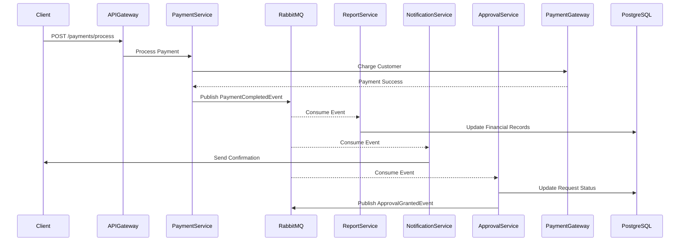
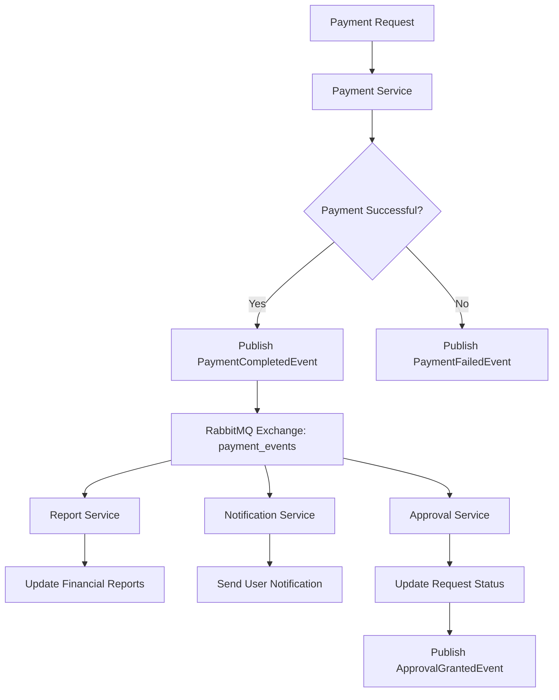
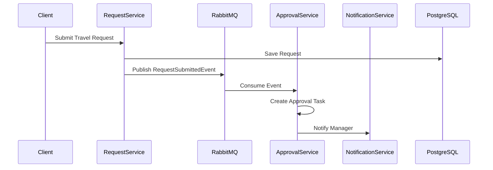
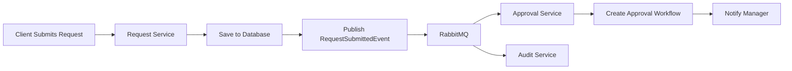
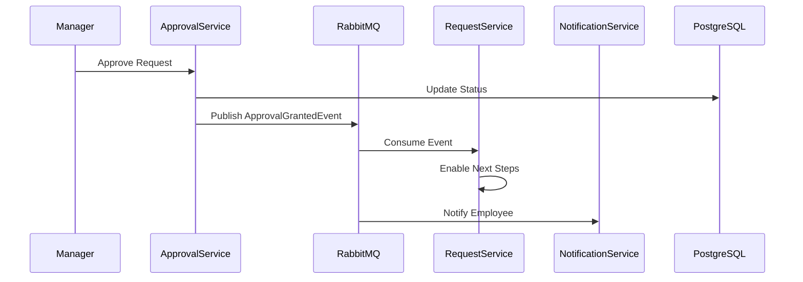
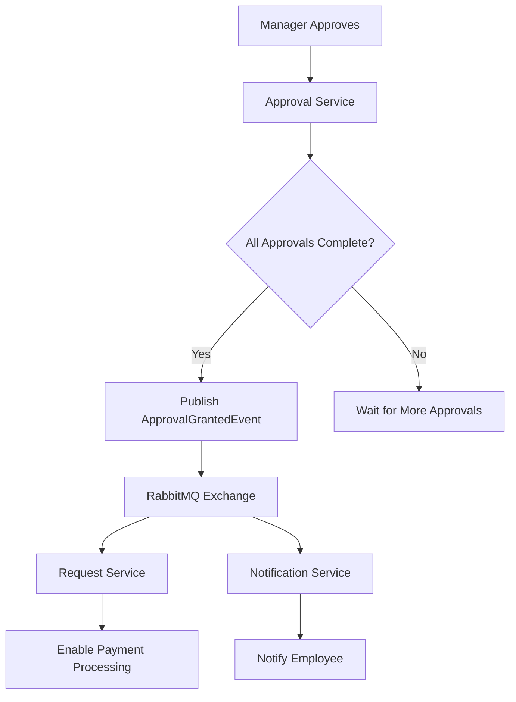
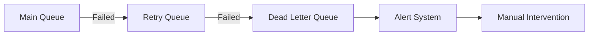

# مخطط تدفق الأحداث (Flow of Events)

## نظرة عامة

يوضح هذا المستند كيف تحدث الأحداث وتنتشر عبر النظام باستخدام **RabbitMQ** في بنية Event-Driven Architecture.

## الأحداث الرئيسية

### 1. `PaymentCompletedEvent`

هذا هو الحدث الأهم في النظام، يتم إطلاقه عند اكتمال معالجة الدفع.

#### مخطط Mermaid.js





### 2. `RequestSubmittedEvent`





### 3. `ApprovalGrantedEvent`





## بنية RabbitMQ

### Exchanges
- `payment_events`: نوع direct للأحداث المالية
- `request_events`: نوع topic لأحداث الطلبات
- `notification_events`: نوع fanout للإشعارات

### Queues
- `payment.completed.queue`: لمعالجة المدفوعات المكتملة
- `request.submitted.queue`: لمعالجة الطلبات الجديدة
- `approval.granted.queue`: لمعالجة الموافقات

### Bindings
```
payment_events ----→ payment.completed.queue
request_events ----→ request.submitted.queue
approval_events ----→ approval.granted.queue
```

## معالجة الأخطاء

### Dead Letter Queue (DLQ)


### سياسات إعادة المحاولة
- أول إعادة محاولة: بعد 5 ثوانٍ
- ثاني إعادة محاولة: بعد 30 ثانية
- ثالث إعادة محاولة: بعد 5 دقائق
- بعد الفشل: إرسال إلى DLQ

## مراقبة الأحداث

- تتبع عدد الأحداث المنشورة والمستهلكة
- قياس زمن الاستجابة لكل خدمة
- تنبيهات عند تجاوز الحدود
- سجلات مفصلة لتصحيح الأخطاء
