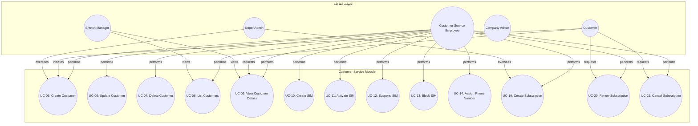
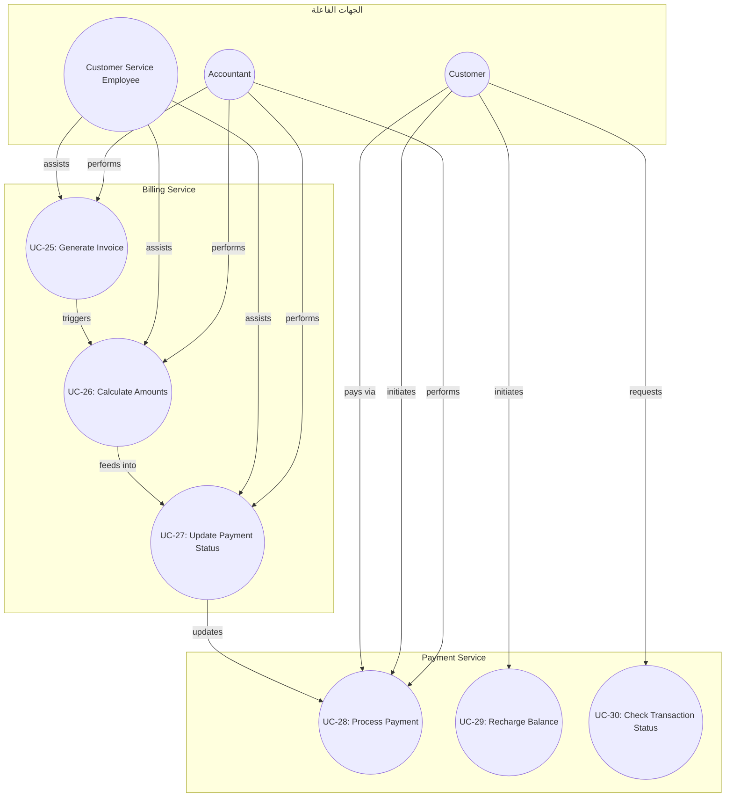
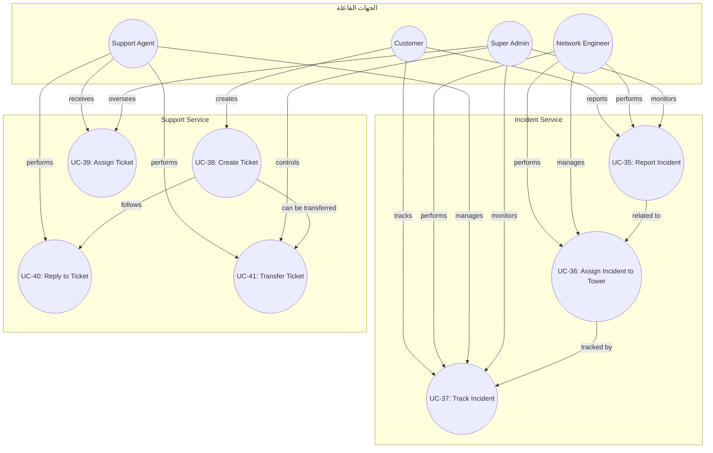

# مخططات حالات الاستخدام

## Use Case Diagrams

## المقدمة
مخططات حالات الاستخدام لنظام إدارة شركات الاتصالات، مرسومة بصيغة Mermaid. جميع المخططات مبنية على المخرجات الموثقة في `docs/system-actors.md` و `docs/phase-2-use-cases-high-level.md`.

---

## Diagram 1: System Overview

```mermaid
graph TB
    subgraph External["المستخدم الخارجي"]
        Customer(("Customer 🔵"))
    end

    subgraph Internal["المستخدمون الداخليون"]
        SuperAdmin(("Super Admin"))
        CompanyAdmin(("Company Admin"))
        BranchManager(("Branch Manager"))
        CustomerService(("Customer Service Employee"))
        Accountant(("Accountant"))
        NetworkEngineer(("Network Engineer"))
        SupportAgent(("Support Agent"))
    end

    subgraph UC1["Identity Service"]
        UC01(("UC-01: Login"))
        UC02(("UC-02: Logout"))
        UC03(("UC-03: Register User"))
        UC04(("UC-04: Refresh Token"))
    end

    subgraph UC2["Customer Service"]
        UC05(("UC-05: Create Customer"))
        UC06(("UC-06: Update Customer"))
        UC07(("UC-07: Delete Customer"))
        UC08(("UC-08: List Customers"))
        UC09(("UC-09: View Customer Details"))
    end

    subgraph UC3["SIM & Number"]
        UC10(("UC-10: Create SIM"))
        UC11(("UC-11: Activate SIM"))
        UC12(("UC-12: Suspend SIM"))
        UC13(("UC-13: Block SIM"))
        UC14(("UC-14: Assign Phone Number"))
    end

    subgraph UC4["Product / Package"]
        UC15(("UC-15: Create Package"))
        UC16(("UC-16: Update Package"))
        UC17(("UC-17: Delete Package"))
        UC18(("UC-18: List Packages"))
    end

    subgraph UC5["Subscription"]
        UC19(("UC-19: Create Subscription"))
        UC20(("UC-20: Renew Subscription"))
        UC21(("UC-21: Cancel Subscription"))
    end

    subgraph UC6["Billing"]
        UC25(("UC-25: Generate Invoice"))
        UC26(("UC-26: Calculate Amounts"))
        UC27(("UC-27: Update Payment Status"))
    end

    subgraph UC7["Payment"]
        UC28(("UC-28: Process Payment"))
        UC29(("UC-29: Recharge Balance"))
        UC30(("UC-30: Check Transaction Status"))
    end

    subgraph UC8["Network"]
        UC31(("UC-31: Manage Towers"))
        UC32(("UC-32: Manage Stations"))
        UC33(("UC-33: Manage Devices"))
        UC34(("UC-34: Manage Coverage Areas"))
    end

    subgraph UC9["Incident"]
        UC35(("UC-35: Report Incident"))
        UC36(("UC-36: Assign Incident to Tower"))
        UC37(("UC-37: Track Incident"))
    end

    subgraph UC10["Support"]
        UC38(("UC-38: Create Ticket"))
        UC39(("UC-39: Assign Ticket"))
        UC40(("UC-40: Reply to Ticket"))
        UC41(("UC-41: Transfer Ticket"))
    end

    subgraph UC11["End-to-End"]
        UC42(("UC-42: Full Customer Lifecycle"))
    end

    Customer -->|uses| UC05
    Customer -->|uses| UC19
    Customer -->|uses| UC28
    Customer -->|uses| UC29
    Customer -->|uses| UC30
    Customer -->|uses| UC38
    Customer -->|uses| UC42

    CustomerService -->|manages| UC05
    CustomerService -->|manages| UC06
    CustomerService -->|manages| UC07
    CustomerService -->|manages| UC08
    CustomerService -->|manages| UC09
    CustomerService -->|manages| UC10
    CustomerService -->|manages| UC11
    CustomerService -->|manages| UC12
    CustomerService -->|manages| UC13
    CustomerService -->|manages| UC14
    CustomerService -->|manages| UC19
    CustomerService -->|manages| UC20
    CustomerService -->|manages| UC21
    CustomerService -->|manages| UC25
    CustomerService -->|manages| UC26

    Accountant -->|handles| UC25
    Accountant -->|handles| UC26
    Accountant -->|handles| UC27
    Accountant -->|manages| UC28

    NetworkEngineer -->|manages| UC31
    NetworkEngineer -->|manages| UC32
    NetworkEngineer -->|manages| UC33
    NetworkEngineer -->|manages| UC34
    NetworkEngineer -->|manages| UC35
    NetworkEngineer -->|manages| UC36
    NetworkEngineer -->|manages| UC37

    SupportAgent -->|manages| UC39
    SupportAgent -->|manages| UC40
    SupportAgent -->|manages| UC41
    SupportAgent -->|manages| UC37

    SuperAdmin -->|controls| UC03
    SuperAdmin -->|controls| UC04
    SuperAdmin -->|monitors| UC05
    SuperAdmin -->|monitors| UC19
    SuperAdmin -->|monitors| UC42

    CompanyAdmin -->|manages| UC15
    CompanyAdmin -->|manages| UC16
    CompanyAdmin -->|manages| UC17
    CompanyAdmin -->|manages| UC18

    Customer -->|initiates| UC42
    CustomerService -->|executes| UC42
    NetworkEngineer -->|supports| UC42
    Accountant -->|finances| UC42
```

---

## Diagram 2: Customer Service Module

---

## Diagram 3: Billing & Payment Module

---

## Diagram 4: Support & Incident Module

---

## ملخص المخططات

| رقم المخطط | الوصف | عدد العناصر |
|---|---|---|
| Diagram 1 | System Overview | 7 Actors + 42 Use Cases |
| Diagram 2 | Customer Service Module | 5 Actors + 13 Use Cases |
| Diagram 3 | Billing & Payment Module | 3 Actors + 6 Use Cases |
| Diagram 4 | Support & Incident Module | 4 Actors + 7 Use Cases |
| **المجموع** | **4 مخططات** | **19 Actor-Use Case relationships** |

---

> **تاريخ التحديث:** 2026-09-26
> **المصدر:** docs/system-actors.md و docs/phase-2-use-cases-high-level.md
> **عدد المخططات:** 4
> **الصيغة:** Mermaid Graph
> **الحالة:** Confirmed
