# مخطط تدفق البيانات — المستوى 0 (Context Diagram)

## Data Flow Diagram — Level 0 (Context Diagram)

## المقدمة
مخطط تدفق البيانات للمستوى 0 (Context Diagram) لنظام إدارة شركات الاتصالات، مرسوم بصيغة Mermaid Flowchart. يوضح النظام كعملية واحدة مركزية محاطة بالجهات الخارجية مع تدفقات البيانات الرئيسية بينها.

---

## DFD Level 0 — Context Diagram

```mermaid
flowchart TD
    subgraph ExternalEntities["الجهات الخارجية (External Entities)"]
        SA["Super Admin"]
        CA["Company Admin"]
        BM["Branch Manager"]
        CSE["Customer Service Employee"]
        ACC["Accountant"]
        NE["Network Engineer"]
        SA2["Support Agent"]
        C["Customer"]
    end

    TCMS["TCMS\nنظام إدارة شركات الاتصالات"]

    subgraph DataFlows["تدفقات البيانات الرئيسية"]
        direction TB
        C -->|1. Request Service<br/>2. Submit Payment<br/>3. Create Ticket<br/>4. View Details| TCMS
        TCMS -->|5. Invoice<br/>6. Notification<br/>7. Service Status<br/>8. Billing Info| C

        CSE -->|9. Customer Data<br/>10. SIM Activation Request<br/>11. Subscription Data<br/>12. Payment Info| TCMS
        TCMS -->|13. Customer Details<br/>14. SIM Status<br/>15. Subscription Status<br/>16. Invoice Details| CSE

        ACC -->|17. Payment Processing Request<br/>18. Invoice Generation Request| TCMS
        TCMS -->|19. Financial Reports<br/>20. Invoice Status<br/>21. Payment Confirmation| ACC

        NE -->|22. Incident Report<br/>23. Tower Status Update<br/>24. Device Status| TCMS
        TCMS -->|25. Network Status<br/>26. Incident Details<br/>27. Coverage Info| NE

        SA2 -->|28. Ticket Response<br/>29. Ticket Status Update<br/>30. Complaint Details| TCMS
        TCMS -->|31. Ticket Details<br/>32. Customer Complaints<br/>33. Incident Info| SA2

        SA -->|34. Management Commands<br/>35. Reports Requests<br/>36. Audit Requests| TCMS
        TCMS -->|37. Reports<br/>38. Audit Logs<br/>39. System Status| SA

        CA -->|40. Management Commands<br/>41. Package Management<br/>42. Reports Requests| TCMS
        TCMS -->|43. Reports<br/>44. System Status<br/>45. Subscription Data| CA

        BM -->|46. Reports Requests<br/>47. Branch Operations Data| TCMS
        TCMS -->|48. Reports<br/>49. Branch Operations<br/>50. Customer List| BM
    end

    style TCMS fill:#4CAF50,color:#fff,stroke:#333,stroke-width:3px
    style ExternalEntities fill:#e1f5fe,stroke:#333
    style DataFlows fill:#fff3e0,stroke:#333
```

---

## تفاصيل الجهات الخارجية وتدفقات البيانات

### 1. Customer

| الرقم | اتجاه التدفق | نوع البيانات |
|---|---|---|
| 1 | Customer → TCMS | Request Service |
| 2 | Customer → TCMS | Submit Payment |
| 3 | Customer → TCMS | Create Ticket |
| 4 | Customer → TCMS | View Details |
| 5 | TCMS → Customer | Invoice |
| 6 | TCMS → Customer | Notification |
| 7 | TCMS → Customer | Service Status |
| 8 | TCMS → Customer | Billing Info |

### 2. Customer Service Employee

| الرقم | اتجاه التدفق | نوع البيانات |
|---|---|---|
| 9 | CSE → TCMS | Customer Data |
| 10 | CSE → TCMS | SIM Activation Request |
| 11 | CSE → TCMS | Subscription Data |
| 12 | CSE → TCMS | Payment Info |
| 13 | TCMS → CSE | Customer Details |
| 14 | TCMS → CSE | SIM Status |
| 15 | TCMS → CSE | Subscription Status |
| 16 | TCMS → CSE | Invoice Details |

### 3. Accountant

| الرقم | اتجاه التدفق | نوع البيانات |
|---|---|---|
| 17 | Accountant → TCMS | Payment Processing Request |
| 18 | Accountant → TCMS | Invoice Generation Request |
| 19 | TCMS → Accountant | Financial Reports |
| 20 | TCMS → Accountant | Invoice Status |
| 21 | TCMS → Accountant | Payment Confirmation |

### 4. Network Engineer

| الرقم | اتجاه التدفق | نوع البيانات |
|---|---|---|
| 22 | Network Engineer → TCMS | Incident Report |
| 23 | Network Engineer → TCMS | Tower Status Update |
| 24 | Network Engineer → TCMS | Device Status |
| 25 | TCMS → Network Engineer | Network Status |
| 26 | TCMS → Network Engineer | Incident Details |
| 27 | TCMS → Network Engineer | Coverage Info |

### 5. Support Agent

| الرقم | اتجاه التدفق | نوع البيانات |
|---|---|---|
| 28 | Support Agent → TCMS | Ticket Response |
| 29 | Support Agent → TCMS | Ticket Status Update |
| 30 | Support Agent → TCMS | Complaint Details |
| 31 | TCMS → Support Agent | Ticket Details |
| 32 | TCMS → Support Agent | Customer Complaints |
| 33 | TCMS → Support Agent | Incident Info |

### 6. Super Admin

| الرقم | اتجاه التدفق | نوع البيانات |
|---|---|---|
| 34 | Super Admin → TCMS | Management Commands |
| 35 | Super Admin → TCMS | Reports Requests |
| 36 | Super Admin → TCMS | Audit Requests |
| 37 | TCMS → Super Admin | Reports |
| 38 | TCMS → Super Admin | Audit Logs |
| 39 | TCMS → Super Admin | System Status |

### 7. Company Admin

| الرقم | اتجاه التدفق | نوع البيانات |
|---|---|---|
| 40 | Company Admin → TCMS | Management Commands |
| 41 | Company Admin → TCMS | Package Management |
| 42 | Company Admin → TCMS | Reports Requests |
| 43 | TCMS → Company Admin | Reports |
| 44 | TCMS → Company Admin | System Status |
| 45 | TCMS → Company Admin | Subscription Data |

### 8. Branch Manager

| الرقم | اتجاه التدفق | نوع البيانات |
|---|---|---|
| 46 | Branch Manager → TCMS | Reports Requests |
| 47 | Branch Manager → TCMS | Branch Operations Data |
| 48 | TCMS → Branch Manager | Reports |
| 49 | TCMS → Branch Manager | Branch Operations |
| 50 | TCMS → Branch Manager | Customer List |

---

## ملخص المخطط

| المعيار | القيمة |
|---|---|
| عدد الجهات الخارجية | 8 |
| عدد تدفقات البيانات الرئيسية | 50 |
| عدد التدفقات الصادرة (TCMS → External) | 25 |
| عدد التدفقات الواردة (External → TCMS) | 25 |
| عدد التدفقات الإجمالي | 50 |
| النظام المركزي | TCMS (نظام إدارة شركات الاتصالات) |
| Message Broker | RabbitMQ (مُدمج في النظام) |

---

> **تاريخ التحديث:** 2026-09-26
> **المصدر:** docs/system-actors.md و docs/system-modules.md و docs/system-operations.md
> **المستوى:** Level 0 (Context Diagram)
> **الصيغة:** Mermaid Flowchart
> **الحالة:** Confirmed
