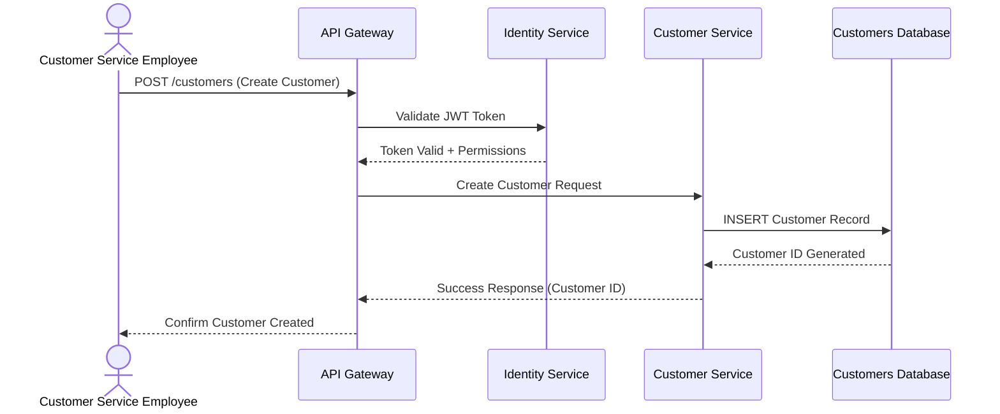
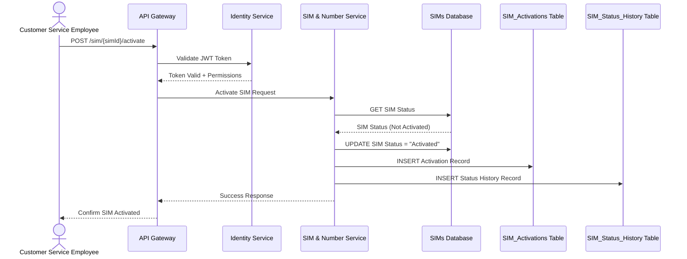
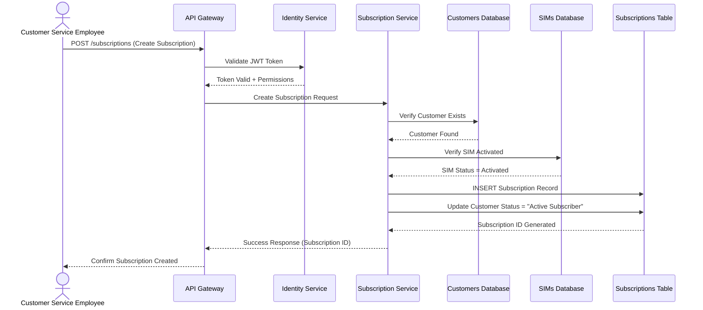
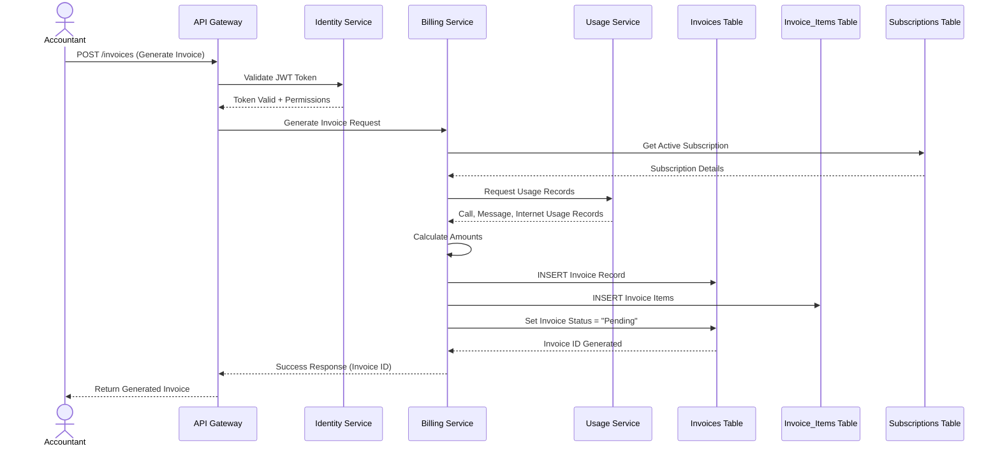
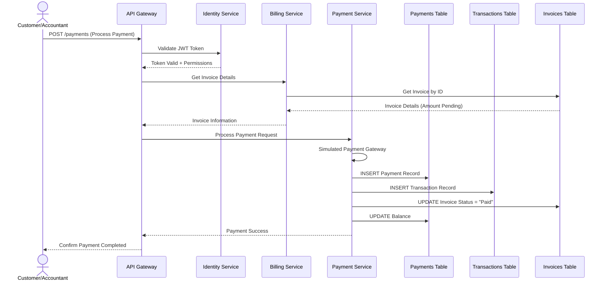
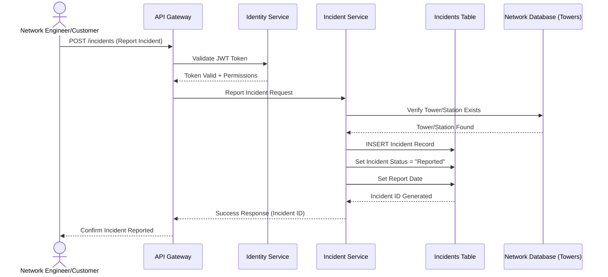
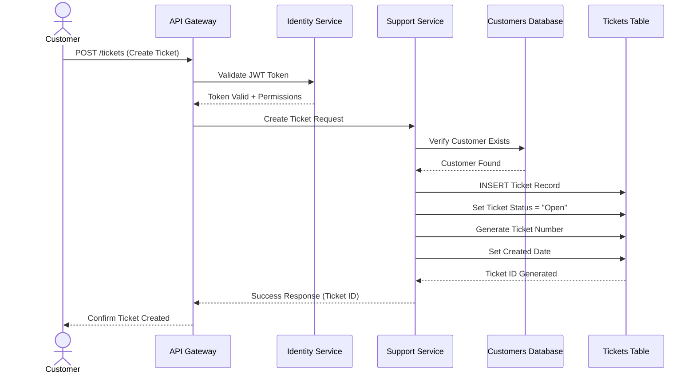
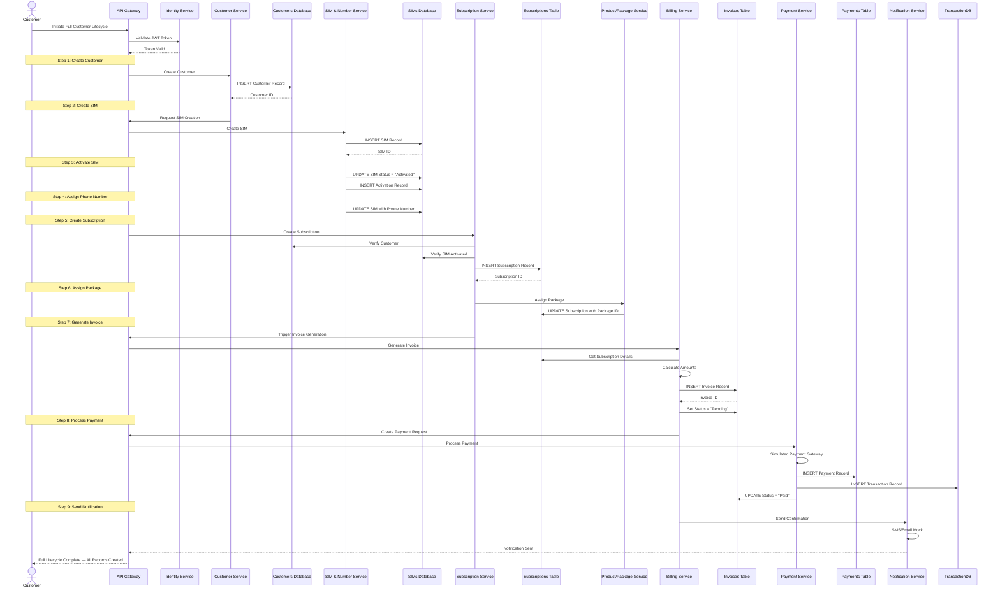

# تدفقات الإجراء (Flow of Action)

## Flow of Action

## المقدمة
تدفقات الإجراء للحالات الأساسية الثمانية، مرسومة بصيغة Mermaid Sequence Diagrams. جميع التدفقات مبنية على السيناريوهات التفصيلية الموثقة في `docs/phase-2-detailed-scenarios.md` وبنية النظام الموثقة في `docs/project-boundaries.md` (Microservices + API Gateway + Event-Driven Architecture).

---

## UC-05: Create Customer

---

## UC-11: Activate SIM

---

## UC-19: Create Subscription

---

## UC-25: Generate Invoice

---

## UC-28: Process Payment

---

## UC-35: Report Incident

---

## UC-38: Create Ticket

---

## UC-42: Full Customer Lifecycle (End-to-End)

---

## ملخص تدفقات الإجراء

| الرقم | حالة الاستخدام | الخدمات المشاركة | قواعد البيانات |
|---|---|---|---|
| UC-05 | Create Customer | Identity, Customer | Customers DB |
| UC-11 | Activate SIM | Identity, SIM & Number | SIMs, SIM_Activations, SIM_Status_History |
| UC-19 | Create Subscription | Identity, Subscription | Customers, SIMs, Subscriptions |
| UC-25 | Generate Invoice | Identity, Billing, Usage | Invoices, Invoice_Items, Subscriptions |
| UC-28 | Process Payment | Identity, Billing, Payment | Payments, Transactions, Invoices |
| UC-35 | Report Incident | Identity, Incident | Incidents, Network (Towers) |
| UC-38 | Create Ticket | Identity, Support | Tickets, Customers |
| UC-42 | Full Customer Lifecycle | Identity, Customer, SIM, Subscription, Package, Billing, Payment, Notification | جميع قواعد البيانات |

---

> **تاريخ التحديث:** 2026-09-26
> **المصدر:** docs/phase-2-detailed-scenarios.md و docs/system-operations.md و docs/project-boundaries.md
> **عدد تدفقات الإجراء:** 8
> **الصيغة:** Mermaid Sequence Diagram
> **الحالة:** Confirmed
