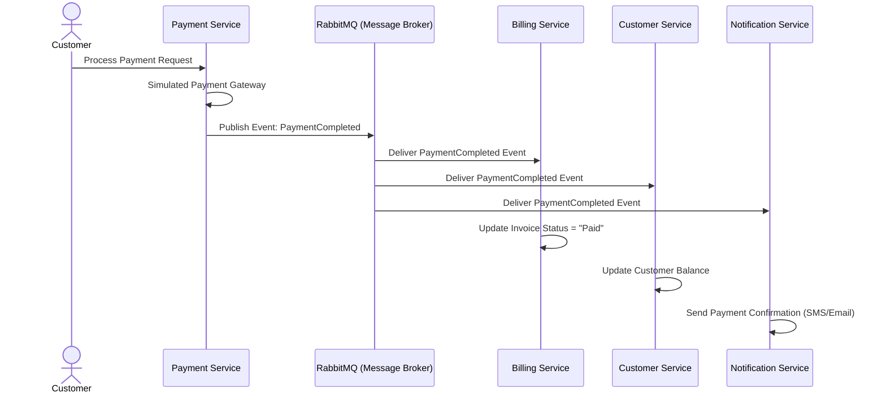
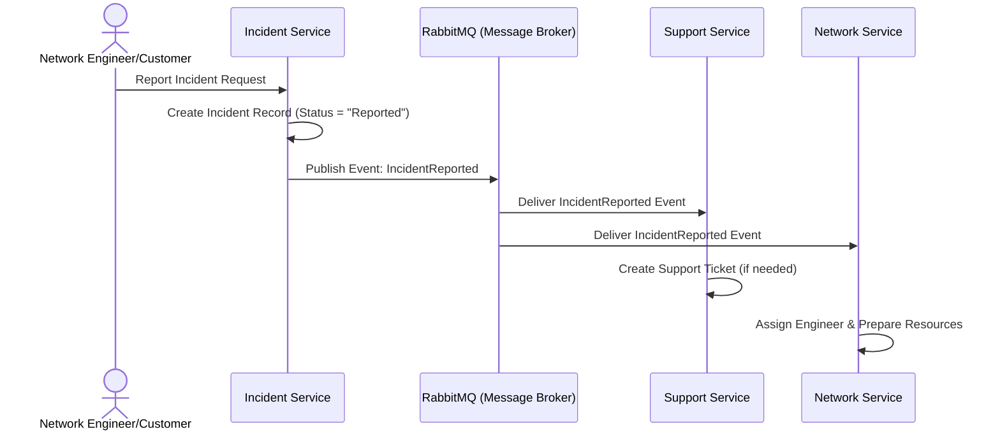
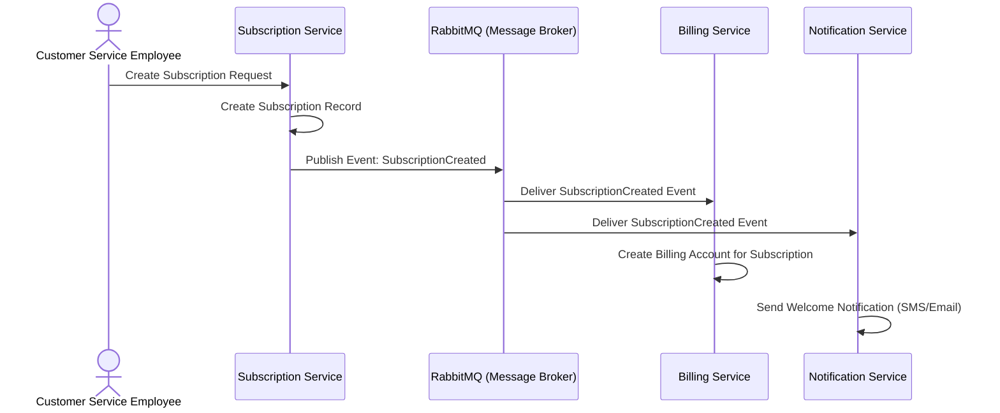
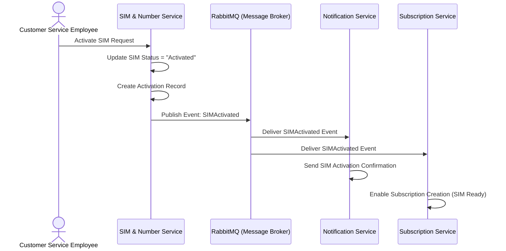
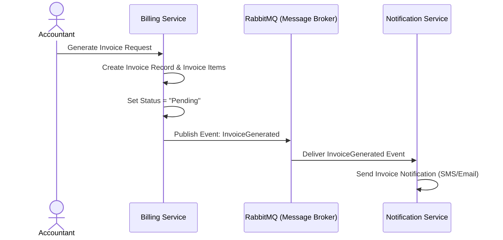
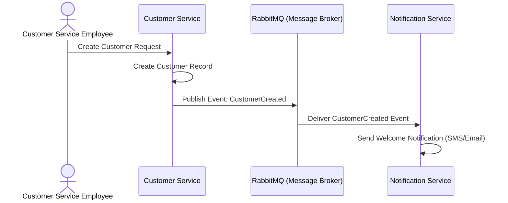

# تدفقات الأحداث (Flow of Event)

## Flow of Event

## المقدمة
تدفقات الأحداث (Event-Driven Processes) للحالات الرئيسية، مرسومة بصيغة Mermaid Sequence Diagrams. جميع التدفقات تتبع بنية النظام الموثقة في `docs/project-boundaries.md` (Microservices + API Gateway + Event-Driven Architecture with RabbitMQ).

---

## Event 1: PaymentCompleted

**الناشر:** Payment Service  
**المستقبلون:** Billing Service, Customer Service, Notification Service  
**المُحفِّز:** بعد نجاح عملية دفع (UC-28)  
**اسم الحدث:** `PaymentCompleted`  
**البيانات المُرسَلة (Payload):** `{ transactionId, paymentAmount, paymentStatus, invoiceId, customerId, timestamp }`

**تفاصيل الحدث:**
| الحقل | القيمة |
|---|---|
| Event Name | `PaymentCompleted` |
| Publisher | Payment Service |
| Message Broker | RabbitMQ |
| Subscribers | Billing Service, Customer Service, Notification Service |
| Payload | `{ transactionId, paymentAmount, paymentStatus, invoiceId, customerId, timestamp }` |

---

## Event 2: IncidentReported

**الناشر:** Incident Service  
**المستقبلون:** Support Service, Network Service  
**المُحفِّز:** بعد تسجيل عطل (UC-35)  
**اسم الحدث:** `IncidentReported`  
**البيانات المُرسَلة (Payload):** `{ incidentId, towerId, stationId, description, severity, status, reportedDate, reportedBy }`

**تفاصيل الحدث:**
| الحقل | القيمة |
|---|---|
| Event Name | `IncidentReported` |
| Publisher | Incident Service |
| Message Broker | RabbitMQ |
| Subscribers | Support Service, Network Service |
| Payload | `{ incidentId, towerId, stationId, description, severity, status, reportedDate, reportedBy }` |

---

## Event 3: SubscriptionCreated

**الناشر:** Subscription Service  
**المستقبلون:** Billing Service, Notification Service  
**المُحفِّز:** بعد إنشاء اشتراك (UC-19)  
**اسم الحدث:** `SubscriptionCreated`  
**البيانات المُرسَلة (Payload):** `{ subscriptionId, customerId, simId, phoneNumber, packageId, startDate, billingCycle, status }`

**تفاصيل الحدث:**
| الحقل | القيمة |
|---|---|
| Event Name | `SubscriptionCreated` |
| Publisher | Subscription Service |
| Message Broker | RabbitMQ |
| Subscribers | Billing Service, Notification Service |
| Payload | `{ subscriptionId, customerId, simId, phoneNumber, packageId, startDate, billingCycle, status }` |

---

## Event 4: SIMActivated

**الناشر:** SIM & Number Service  
**المستقبلون:** Notification Service, Subscription Service  
**المُحفِّز:** بعد تفعيل SIM (UC-11)  
**اسم الحدث:** `SIMActivated`  
**البيانات المُرسَلة (Payload):** `{ simId, iccid, msisdn, activationDate, customerId, status }`

**تفاصيل الحدث:**
| الحقل | القيمة |
|---|---|
| Event Name | `SIMActivated` |
| Publisher | SIM & Number Service |
| Message Broker | RabbitMQ |
| Subscribers | Notification Service, Subscription Service |
| Payload | `{ simId, iccid, msisdn, activationDate, customerId, status }` |

---

## Event 5: InvoiceGenerated

**الناشر:** Billing Service  
**المستقبلون:** Notification Service  
**المُحفِّز:** بعد إنشاء فاتورة (UC-25)  
**اسم الحدث:** `InvoiceGenerated`  
**البيانات المُرسَلة (Payload):** `{ invoiceId, customerId, subscriptionId, totalAmount, items, dueDate, status, createdDate }`

**تفاصيل الحدث:**
| الحقل | القيمة |
|---|---|
| Event Name | `InvoiceGenerated` |
| Publisher | Billing Service |
| Message Broker | RabbitMQ |
| Subscribers | Notification Service |
| Payload | `{ invoiceId, customerId, subscriptionId, totalAmount, items, dueDate, status, createdDate }` |

---

## Event 6: CustomerCreated

**الناشر:** Customer Service  
**المستقبلون:** Notification Service  
**المُحفِّز:** بعد إنشاء عميل (UC-05)  
**اسم الحدث:** `CustomerCreated`  
**البيانات المُرسَلة (Payload):** `{ customerId, name, address, phone, email, customerType, registrationDate, status }`

**تفاصيل الحدث:**
| الحقل | القيمة |
|---|---|
| Event Name | `CustomerCreated` |
| Publisher | Customer Service |
| Message Broker | RabbitMQ |
| Subscribers | Notification Service |
| Payload | `{ customerId, name, address, phone, email, customerType, registrationDate, status }` |

---

## ملخص تدفقات الأحداث

| الرقم | اسم الحدث | الناشر | المستقبلون | المُحفِّز |
|---|---|---|---|---|
| 1 | PaymentCompleted | Payment Service | Billing, Customer, Notification | UC-28 |
| 2 | IncidentReported | Incident Service | Support, Network | UC-35 |
| 3 | SubscriptionCreated | Subscription Service | Billing, Notification | UC-19 |
| 4 | SIMActivated | SIM & Number Service | Notification, Subscription | UC-11 |
| 5 | InvoiceGenerated | Billing Service | Notification | UC-25 |
| 6 | CustomerCreated | Customer Service | Notification | UC-05 |

**بنية الرسائل:**
- **Message Broker:** RabbitMQ
- **نمط النشر:** Publish-Subscribe
- **ضمان التسليم:** كل حدث يُرسل إلى جميع المشتركين المسجلين
- **الاستقلالية:** كل خدمة مستقبلة تعالج الحدث بشكل مستقل دون تأثير على الناشر أو الخدمات الأخرى

---

> **تاريخ التحديث:** 2026-09-26
> **المصدر:** docs/phase-2-detailed-scenarios.md و docs/system-modules.md و docs/system-operations.md و docs/project-boundaries.md
> **عدد الأحداث:** 6
> **الصيغة:** Mermaid Sequence Diagram
> **الحالة:** Confirmed
